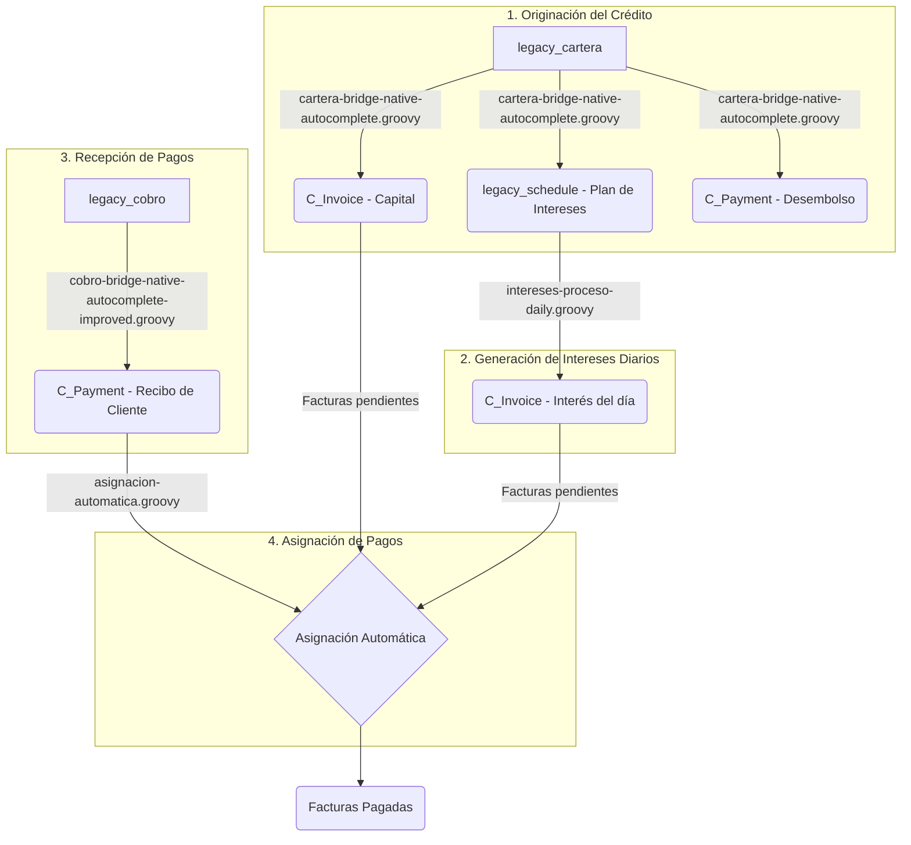

# Contexto del Flujo de Cartera para Agentes de IA

## 1. Introducción

Este documento proporciona un contexto técnico detallado sobre el flujo de negocio principal del sistema, centrado en la **Cartera (Créditos), Cobros, Cálculo de Intereses y Asignación de Pagos**. Está diseñado para que un agente de IA tenga la información necesaria para comprender y modificar el flujo de forma segura y eficiente.

## 2. Entidades Principales (Tablas de Base de Datos)

El flujo se articula en torno a una combinación de tablas "legacy" (de transición) y tablas estándar del ERP iDempiere.

-   `legacy_cartera`: Tabla de transición donde se originan los créditos. Contiene todos los datos iniciales del préstamo, como monto, interés, plazo y cliente. Un registro aquí es el punto de partida para todo el ciclo de vida del crédito.
    -   **Campos Clave**: `legacy_cartera_id`, `c_bpartner_id`, `monto`, `valorinteres`, `dias_cre`, `fecha`, `synced`, `local_id` (almacena el ID de la `C_Invoice` principal), `payment_id` (almacena el ID del `C_Payment` de desembolso).

-   `legacy_cobro`: Tabla de transición que registra los pagos (abonos) realizados por los clientes. Cada vez que un cliente paga, se inserta un registro aquí antes de ser procesado por el sistema.
    -   **Campos Clave**: `legacy_cobro_id`, `c_bpartner_id`, `id_cartera` (referencia a `legacy_cartera`), `abono`, `operacion` (fecha del pago), `synced`, `local_id` (almacena el ID del `C_Payment` generado).

-   `legacy_schedule`: Contiene el plan de pagos detallado exclusivamente para los **intereses** de un crédito. Se genera a partir de un registro en `legacy_cartera` y define cuánto interés se debe facturar cada día.
    -   **Campos Clave**: `legacy_schedule_id`, `legacy_cartera_id`, `c_invoice_id` (referencia a la factura principal de capital), `duedate` (fecha de vencimiento de la cuota de interés), `dueamt` (monto de la cuota), `processed`, `ref_invoice_id` (almacena el ID de la `C_Invoice` de interés generada).

-   `C_Invoice` (Factura): Documento estándar de iDempiere. Se utiliza para dos propósitos:
    1.  **Factura de Capital**: Una única factura por el monto total del capital del crédito, creada al inicio del proceso.
    2.  **Factura de Interés**: Múltiples facturas, una por cada cuota de interés diaria que vence según el `legacy_schedule`.

-   `C_Payment` (Pago/Cobro): Documento estándar de iDempiere. Se utiliza para dos propósitos:
    1.  **Desembolso**: Un pago de salida (`IsReceipt='N'`) que representa el dinero entregado al cliente.
    2.  **Recibo de Cliente**: Un pago de entrada (`IsReceipt='Y'`) que representa el abono del cliente. Inicialmente, se crea como un saldo a favor del cliente, sin asignar a ninguna factura.

-   `C_AllocationHdr` y `C_AllocationLine` (Asignación): Documentos estándar que vinculan los pagos (`C_Payment`) con las deudas (`C_Invoice`). El `Hdr` es la cabecera y las `Line` son los detalles que especifican qué pago se aplica a qué factura y por qué monto.

## 3. Diagrama del Flujo

## 4. Flujo de Trabajo Detallado

### 1. Originación del Crédito (`cartera-bridge-native-autocomplete.groovy`)

-   **Disparador**: Busca registros en `legacy_cartera` con `synced != 'Y'`, `origen = 'native'` y `aprobado = 'Y'`.
-   **Acciones**:
    1.  **Crea una Factura de Capital (`C_Invoice`)**:
        -   Toma el `monto` del crédito.
        -   Genera una `C_Invoice` (tipo "Nota de Débito", `DOCTYPE_ID = 1000048`) por el capital.
        -   Guarda el ID de esta factura en `legacy_cartera.local_id`.
    2.  **Crea un Desembolso (`C_Payment`)**:
        -   Genera un `C_Payment` de salida (tipo "Pago a Proveedor", `DOCTYPE_ID = 1000049`) por el mismo `monto` para registrar el desembolso del dinero al cliente.
        -   Guarda el ID de este pago en `legacy_cartera.payment_id`.
    3.  **Crea el Plan de Intereses (`legacy_schedule`)**:
        -   Calcula el monto de la cuota de interés (`valorinteres / dias_cre`).
        -   Genera N registros en `legacy_schedule`, uno por cada día del plazo del crédito. Cada registro contiene la fecha de vencimiento y el monto de la cuota de interés.
    4.  **Finalización**: Marca el registro de `legacy_cartera` como procesado (`synced = 'Y'`).

### 2. Generación de Facturas de Interés (`intereses-proceso-daily.groovy`)

-   **Disparador**: Proceso diario que busca en `legacy_schedule` registros donde `DueDate` es hoy y `Processed != 'Y'`.
-   **Acciones**:
    1.  **Crea una Factura de Interés (`C_Invoice`)**:
        -   Por cada cuota de interés vencida, crea una nueva `C_Invoice` (tipo "Interés", `DOCTYPE_ID = 1000051`) por el monto de la cuota (`dueamt`).
    2.  **Actualización**:
        -   Marca el registro en `legacy_schedule` como procesado (`Processed = 'Y'`).
        -   Almacena el ID de la factura de interés recién creada en `legacy_schedule.ref_invoice_id` para referencia.

### 3. Creación de Pagos de Cliente (`cobro-bridge-native-autocomplete-improved.groovy`)

-   **Disparador**: Busca registros en `legacy_cobro` con `synced = 'N'` y `origen = 'native'`.
-   **Acciones**:
    1.  **Crea un Recibo de Cliente (`C_Payment`)**:
        -   Por cada `legacy_cobro`, crea un `C_Payment` (tipo "Recibo de Clientes", `DOCTYPE_ID = 1000050`) por el monto del abono.
        -   Este pago se crea en estado "Completado" pero **no está asignado** a ninguna factura. Representa un saldo a favor del cliente.
    2.  **Actualización**: Marca el `legacy_cobro` como procesado (`synced = 'Y'`) y guarda el ID del `C_Payment` en `legacy_cobro.local_id`.

### 4. Asignación Automática de Pagos (`asignacion-automatica.groovy`)

-   **Disparador**: Busca documentos `C_Payment` (Recibos de Cliente) que están "Completados" pero no tienen ninguna línea de asignación (`C_AllocationLine`).
-   **Acciones**:
    1.  **Búsqueda de Deudas**: Para cada pago, busca todas las `C_Invoice` pendientes de pago (`IsPaid='N'`) para el mismo `C_BPartner_ID`, ordenándolas de la más antigua a la más nueva.
    2.  **Creación de la Asignación (`C_Allocation`)**:
        -   Crea una cabecera de asignación (`C_AllocationHdr`).
        -   Aplica el monto del `C_Payment` a las facturas pendientes en orden cronológico.
        -   Crea una `C_AllocationLine` por cada factura que se está pagando (total o parcialmente).
    3.  **Finalización**: Completa el documento de asignación, lo que actualiza el estado de las facturas a "Pagada" (`IsPaid='Y'`) si se saldaron por completo y deja el `C_Payment` totalmente asignado.
