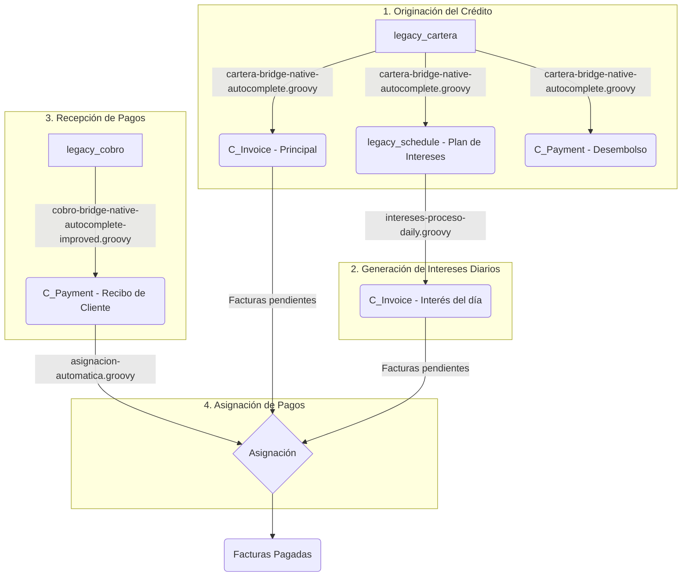

# Documentación del Flujo de Cartera y Cobranza

Este documento describe el ciclo de vida completo de un crédito, desde su originación hasta el pago y la asignación, basado en los scripts de automatización del sistema.

## Entidades Principales

- **`legacy_cartera`**: Tabla de transición que contiene la información original de los créditos aprobados antes de ser procesados y convertidos en documentos estándar de iDempiere.
- **`legacy_cobro`**: Tabla de transición que registra los pagos (abonos) realizados por los clientes antes de ser procesados como pagos en iDempiere.
- **`legacy_schedule`**: Tabla que contiene el plan de pagos detallado (cuotas) exclusivamente para los **intereses** de un crédito. Se genera a partir de una `legacy_cartera`.
- **`C_Invoice`**: Documento estándar de iDempiere (Factura). En este flujo se utiliza para dos propósitos:
    1.  **Factura Principal**: Una factura por el monto total del capital del crédito.
    2.  **Factura de Interés**: Facturas más pequeñas generadas diariamente por cada cuota de interés vencida según el `legacy_schedule`.
- **`C_Payment`**: Documento estándar de iDempiere (Pago/Cobro). Se utiliza para dos propósitos:
    1.  **Desembolso**: Un pago de salida que representa el dinero entregado al cliente al originar el crédito.
    2.  **Recibo de Cliente**: Un pago de entrada que representa el abono realizado por el cliente.

## Diagrama del Flujo

## El Flujo Paso a Paso

El ciclo de vida de un crédito se divide en cuatro procesos automatizados principales:

### 1. Originación del Crédito (`cartera-bridge-native-autocomplete.groovy`)

1.  **Inicio**: El proceso toma un registro de `legacy_cartera` que está aprobado pero no sincronizado (`synced != 'Y'`).
2.  **Creación de Deuda Principal**: Se genera una `C_Invoice` (Factura) por el monto principal del crédito. El ID de esta factura se guarda en `legacy_cartera.local_id`.
3.  **Creación del Plan de Intereses**: Basado en los datos del crédito (días, monto de interés), el script genera un plan de pagos en la tabla `legacy_schedule`. Cada registro es una cuota de interés futura, vinculada a la `legacy_cartera` y a la `C_Invoice` principal.
4.  **Registro del Desembolso**: Se crea un `C_Payment` de salida para registrar el desembolso del dinero al cliente. El ID de este pago se guarda en `legacy_cartera.payment_id`.
5.  **Finalización**: El registro de `legacy_cartera` se marca como sincronizado (`synced = 'Y'`).

### 2. Generación de Facturas de Interés (`intereses-proceso-daily.groovy`)

1.  **Inicio**: El proceso se ejecuta diariamente y busca en `legacy_schedule` las cuotas de interés cuyo vencimiento (`DueDate`) es el día de hoy y que no han sido procesadas.
2.  **Creación de Deuda de Interés**: Por cada cuota de interés vencida, se genera una nueva `C_Invoice` por el monto de la cuota. Esta es una factura separada de la principal.
3.  **Actualización del Plan**: El registro en `legacy_schedule` se marca como procesado (`Processed = 'Y'`) y se le asocia el ID de la factura de interés recién creada (`Ref_Invoice_ID`).

### 3. Creación de Pagos de Cliente (`cobro-bridge-native-autocomplete-improved.groovy`)

1.  **Inicio**: El proceso busca registros de pagos de clientes en `legacy_cobro` que no han sido sincronizados.
2.  **Creación del Recibo**: Por cada `legacy_cobro`, se crea un `C_Payment` (Recibo de Cliente) en iDempiere. Este pago representa el dinero que el cliente ha abonado.
3.  **Estado Inicial del Pago**: Importante: este `C_Payment` se crea en estado "Completado" pero **no asignado**. Simplemente existe como un saldo a favor del cliente.
4.  **Actualización**: El registro de `legacy_cobro` se marca como sincronizado.

### 4. Asignación Automática de Pagos (`asignacion-automatica.groovy`)

1.  **Inicio**: El proceso busca documentos `C_Payment` (Recibos de Cliente) que están completados pero no tienen ninguna asignación.
2.  **Búsqueda de Deudas**: Para cada pago encontrado, el sistema busca todas las `C_Invoice` pendientes de pago para el mismo cliente, ordenándolas de la más antigua a la más nueva. Esto incluye tanto la factura principal como todas las facturas de interés generadas.
3.  **Creación de la Asignación**: El script crea una `C_Allocation` (Asignación) que aplica el monto del `C_Payment` a las facturas pendientes. Comienza a saldar la factura más antigua y continúa con las siguientes hasta que el monto del pago se agota.
4.  **Finalización**: Las facturas quedan total o parcialmente pagadas, y el `C_Payment` queda totalmente asignado. El ciclo de cobranza para ese pago se completa.
